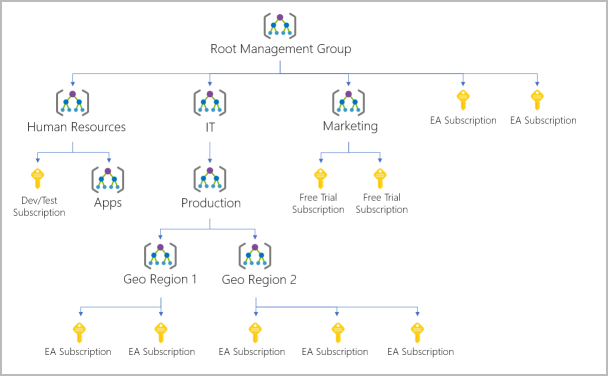

# Core architectural components of Azure

- Azure physical infrastructure
    - datacenters
    - regions
    - availability zones
    - region pairs (Most Azure regions are paired with another region within the same geography (such as US, Europe, or Asia) at least 300 miles away)
    - Sovereign Regions (In addition to regular regions, Azure also has sovereign regions. Sovereign regions are instances of Azure that are isolated from the main instance of Azure. )

- Azure Management infrastructure
    - Azure Management Groups (You organize subscriptions into containers called management groups and apply governance conditions to the management groups.)
        - Example hierarchy
    - Subscription (Azure, subscriptions are a unit of management, billing, and scale.)
        - Billing boundary
        - Access control boundary
    - Resource Groups
    - Resources
