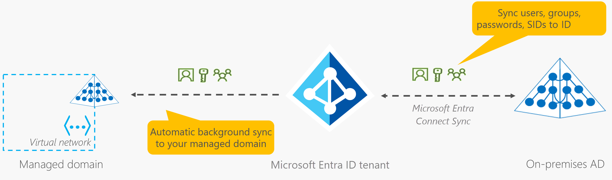
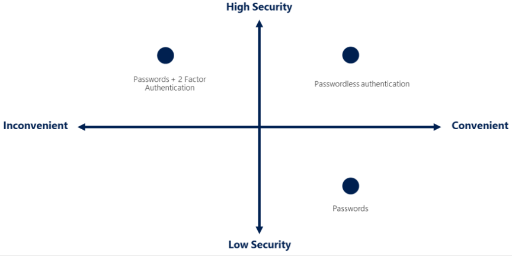

# Azure Identity, Access & Security

- Azure directory services
`Microsoft Entra ID` is a directory service access both Microsoft cloud applications, cloud applications & maintain your on-premises Active Directory deployment.

- Microsoft Entra ID
    - Auth
    - SSO
    - Application Management
    - Device Management

- Connect your on-premises AD with Microsoft Entra ID:
    - `One method of connecting Microsoft` Entra ID with your on-premises AD is using *Microsoft Entra Connect*. It synchronizes changes between both identity systems, so you can use features like SSO, multifactor authentication, and self-service password reset under both systems.

- What is Microsoft Entra Domain Services?
    - Microsoft Entra Domain Services is a service that provides `managed domain services` such as 
        - Domain join
        - Group policy, 
        - lightweight directory access protocol (LDAP)
        - Kerberos/NTLM authentication. 

- How does Microsoft Entra Domain Services work?
    - Microsoft Entra Domain Services managed domain, you define a unique namespace. This namespace is the domain name. Two Windows Server domain controllers are then deployed into your selected Azure region. This deployment of DCs is known as a replica set.
    
    - You don't need to manage, configure, or update these DCs. The Azure platform handles the DCs as part of the managed domain, including backups and encryption at rest using Azure Disk Encryption.

- Is information synchronized?
    - A `managed domain is configured to perform a one-way synchronization` from Microsoft Entra ID to Microsoft Entra Domain Services. 
    -  `In a hybrid environment with an on-premises AD DS environment, Microsoft Entra Connect synchronizes identity information` with Microsoft Entra ID, which is then synchronized to the managed domain.
    

- Azure Authentication Methods
    - Best Practices 
    - SSO
    - MFA
    - Passwordless Auth
    - Microsoft Auth App
    - FIDO & FIDO2 (unphishable standards-based passwordless authentication)
